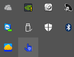

# Installation of a BLE adapter.

Download the driver package from [Senso website](https://senso.me/downloads/senso-driver.zip).
Plug in one of the BLE adapter provided in Senso Gloves package. Once the installation of a driver is completed run zadig.exe utility. Select "Options" menu and check "List All Devices".

Then you need to find CSR8510 A10 device from dropdown and press "Replace Driver" button.

After it is done you should see "Driver Installation: SUCCESS" on the bottom.

You can insert second BLE adapter from the Senso package into your PC.

# Senso Device Driver

Senso Device Driver consists of two parts: Senso BLE Server and Senso User Interface.

## Automatic starting of all the software

There is a convenient "start.bat" script to start all the software needed and start working. Please, use the script and proceed to the [calibrating section](#calibrating).

## Manual starting

We strongly encourage you to use starting script. However if you need to change a configuration and start any piece of our software manually you can use instructions below.

### Senso BLE Server

This application should be run for every Senso BLE adapter installed on the system. For example, if you want to use pair of BLE adapters it should be run twice. By default it is listening 9872 TCP port. To start two instances of this server you need to specify another port by passing /sport=&lt;port&gt; argument to the app. Once run it creates an icon in system tray.

To exit the Senso BLE Server you can right click on system tray icon and select "Exit".

### Senso User Interface

For every Senso Device you need to run one instance of the Senso UI. For example, if you want to use pair of Senso gloves you need to run this application twice. Once started, you need to specify port of the Senso BLE Server in "BLE server configuration" section and press "Connect to server".

Now you can specify if you want to connect to the left or to the right device. You need to specify which port client (game) listens.
Thet select Senso device from dropdown list and click "Connect to glove". After connection has been established you can proceed to the [calibrating section](#calibrating).

#### Command line arguments

| Argument | Default | Description |
|----------|---------|-------------|
| /saddr=&lt;hostname&gt; | 127.0.0.1 | Host where the Senso BLE Server runs |
| /sport=&lt;port&gt; | 9872 | Port of the Senso BLE Server |
| /caddr=&lt;ip&gt; | 0.0.0.0 | IP address to bind listening socket to |
| /cport=&lt;port&gt; | 53450 | Port to listen for client connections |
| /right | None | Use the device as right glove |
| /left | None | Use the device as left glove |
| /udpaddr=&lt;ip&gt; | None | Hostname to use for UDP synchronization connections |
| /udpport=&lt;port&gt; | None | UDP port to use for data synchronization |
| /reconnect | None | Auto reconnect if bluetooth connection is lost |
| /name="aa:bb:cc:dd:ee:ff" | None | Senso device Bluetooth MAC address to connect to. Advertising name can also be used. |

# Calibrating

When a device is connected you need to go through calibration procedure. For your convenience Senso UI shows you a position you need to hold your arm in. Calibrating is an easy procedure and takes a few seconds.

When calibration is done you will see axes of rotations.

# Troubleshooting

##### I have another Bluetooth USB adapter in my system and it stopped working after installing Senso BLE driver.  
Unfortunately you cannot use CSR8510 A10 usb adapter on the same system with Senso Device. We are working hard to solve this problem. You can uninstall the driver using device manager by going to "Universal Serial Devices", right clicking CSR8510 A10 and select "Uninstall driver". Select checkbox "Delete the driver software for this device". After it is done you can unplug and plug the USB adapter back and you should be all set.

