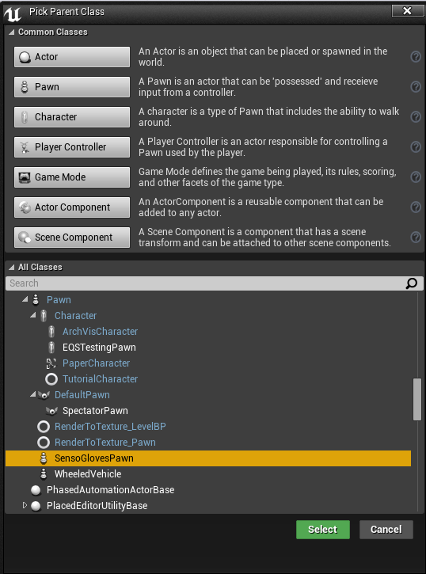
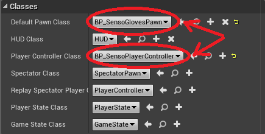
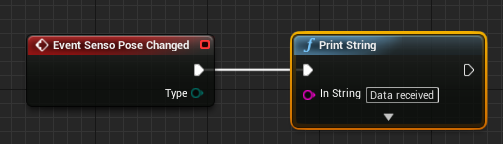

# Unreal Engine 4 Plugin

## Getting started guide

You can download Senso Plugin for UE4 from [here](https://senso.me/dev/downloads/senso-plugin-ue4.zip). Once downloaded you should put it into Plugins directory inside your Project folder.  
Restart UE4 editor with your project and go to `Settings -> Plugins`. Check if **Senso Gloves Plugin** under **Input Devices** has been enabled.  

Now you need to create three new blueprints:
* GameMode
* Blueprint that inherits ASensoPlayerController. Call it for example *BP_SensoPlayerController*
* Blueprint that inherits ASensoGlovesPawn. Call it for example *BP_GlovesPawn*

Now open Blueprint editor for just created GameMode. Set Default Pawn Class to *BP_GlovesPawn* and Player Controller Class to *BP_SensoPlayerController*.

Now open `Settings -> Project Settings -> Maps & Modes` and set Default GameMode to newly created GameMode blueprint.  
Next you need to open Blueprint editor for *BP_GlovesPawn* and add *Event Senso Pose Changed*.

From now on you can use Senso Data and pose your pawn's hand. For details and example usage of Senso Data

## Sample Project

Sample project can be found [here](https://senso.me/dev/downloads/senso-sample-proj-ue4.zip).

## Explanation of BP_GlovesPawn in sample project

TBD

## Class references

References for Senso Plugin classes can be found [here](https://senso.me/dev/ue4/reference)
