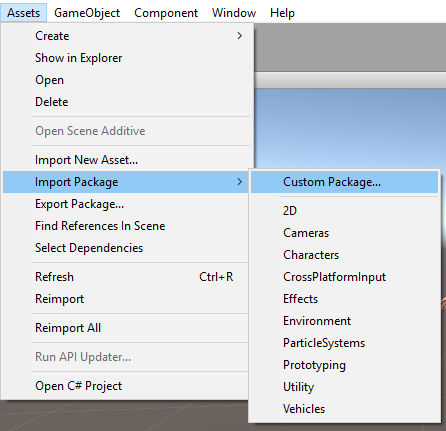
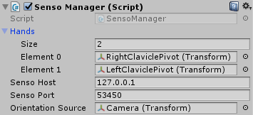

# Getting started

You can download Senso Plugin for Unity3D from [here](https://senso.me/downloads/Unity/SensoPlugin.unitypackage). Once downloaded you import the package into your project. Also you can get sample project to better understand how it works [here](https://senso.me/downloads/Unity/senso-sample-proj-unity.zip). Please note you need to open **Scenes/demo_scene** when you load sample project.

Now you have GameObject components needed for working with Senso Glove.

## Senso Components

### SensoManager

This is the main component that should be presented in the scene. There are public variables for setting SensoHost address, hands to manage and camera orientation source.

* _SensoHost_ address and port: by default it is set to 127.0.0.1:53450. In case Senso UI is loaded on the different computer than the one where the project is running you will need to set it to the location of those machine.

* _Hands_ - this is an array of transforms of all hands you want to be managed by Senso plugin. Those hands should have SensoHand component.

* _Camera orientation source_ - if set, SensoManager will pass Yaw of those object to Senso UI so it could refine orientation of hands in relation to head. I usually set it to main camera controlled by Oculus/Vive driver.

### SensoHand

This is a component that needs to be added to every hand. It receives Senso samples and sets flag _sampleChanged_ to true. Also it calls appropriate methods in _SensoPalm_ and _SensoFingerTip_ components in child game objects.
You will want to inherit from this class and use _SensoHandData_ to actually pose your hand. Please see _MySensoHand_ class in [sample project](https://senso.me/downloads/Unity/senso-sample-proj-unity.zip).

### SensoHandData

Contains parsed sample received from Senso UI. All rotations except fingers are stored in form of quaternions. There are _WristRotation_ and _PalmRotation_.
Fingers' pose is stored in form of Vector3 with x=0. Y is the yaw of the finger and should be applied to the first bone of the finger. Z axis is the pitch and is applied to every finger bone proportionally (I have come to multiplier of 0.5 but I found that it depends on hand model).
Please see _MySensoHand.SetSensoPose_ method for example on how to use _SensoHandData_.

### Other Senso components

There are also _SensoPalm_ and _SensoFingerTip_ components. They are served for specific gameplay physics and interactions so it is subject for later communication while developing the game.
